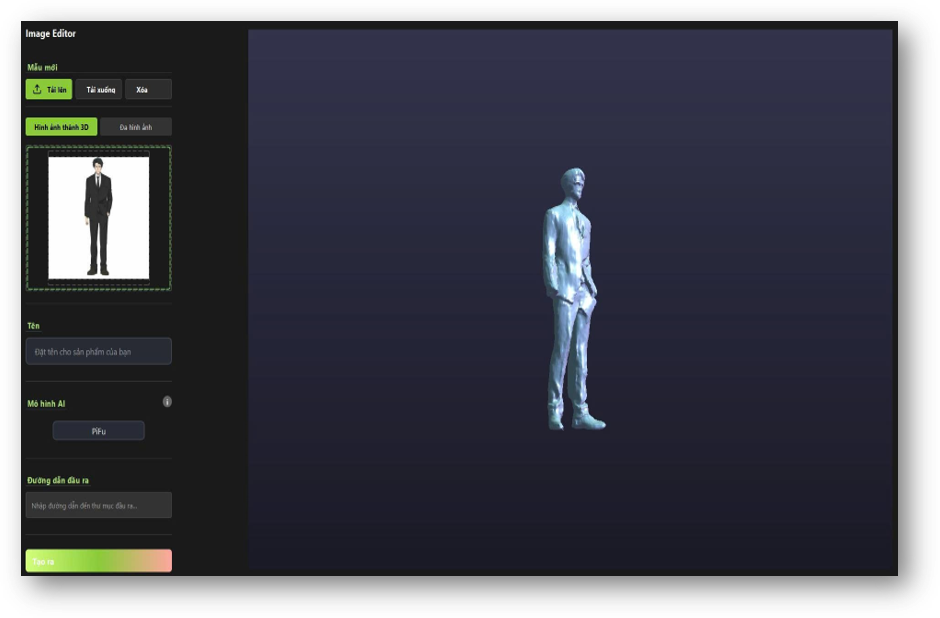
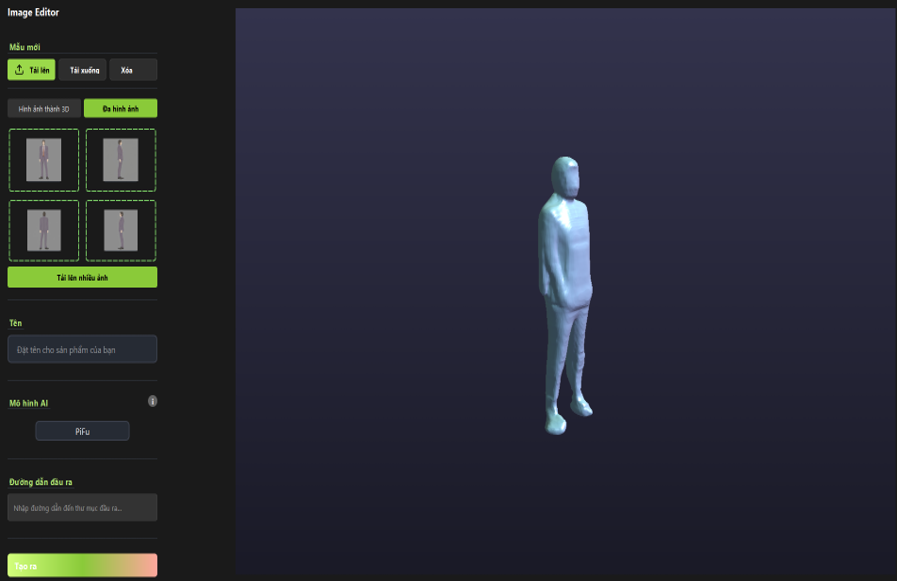

# 3D Human Reconstruction from 2D Images

A desktop application for generating 3D human models from 2D images using advanced deep learning techniques. This project implements multiple state-of-the-art methods including PiFu, PiFuHD, and ICON for high-quality 3D reconstruction.

## Table of Contents

- [Overview](#overview)
- [Screenshots](#screenshots)
- [Features](#features)
- [System Architecture](#system-architecture)
- [Installation](#installation)
- [Usage](#usage)
- [Project Structure](#project-structure)
- [Technical Details](#technical-details)
- [Evaluation Metrics](#evaluation-metrics)
- [Requirements](#requirements)
- [Contributing](#contributing)
- [License](#license)

## Overview

This application provides a user-friendly interface for creating 3D human models from single or multiple 2D images. It leverages deep learning models to reconstruct detailed 3D meshes with proper geometry and topology, suitable for various applications including virtual avatars, gaming, and 3D printing.

The system integrates multiple reconstruction approaches:
- **Single-view reconstruction**: Generate 3D models from a single image using PiFu/PiFuHD
- **Multi-view reconstruction**: Improved accuracy using multiple viewpoints
- **ICON integration**: Advanced implicit clothing reconstruction

## Screenshots

### Application Interface


*Main application interface showing the control panel, upload area, and 3D model preview*

### 3D Reconstruction Results


*Example of 3D human model reconstruction from 2D input image*

## Features

- **Interactive GUI**: Modern PyQt5-based interface with real-time 3D preview
- **Multiple Reconstruction Methods**: Support for single-view and multi-view approaches
- **Real-time 3D Visualization**: OpenGL-based viewer with rotation, zoom, and pan controls
- **Pose Estimation**: Automatic human pose detection using lightweight pose estimation
- **Model Export**: Export generated 3D models in OBJ format
- **Batch Processing**: Process multiple images efficiently
- **Quality Evaluation**: Built-in metrics (IoU, Chamfer Distance, Earth Mover's Distance)
- **GPU Acceleration**: CUDA support for faster processing

## System Architecture

The application consists of three main components:

### 1. Frontend (UI Layer)
- **Main Window**: Central application interface
- **Sidebar**: Control panel for model configuration
- **3D Viewer**: OpenGL-based real-time mesh visualization
- **Upload Area**: Drag-and-drop image upload functionality

### 2. Processing Layer
- **Image Processor**: Preprocessing and pose estimation
- **Model Inference**: Deep learning model execution
- **Mesh Generation**: 3D geometry reconstruction

### 3. Model Layer
- **PiFu (Single-view)**: Pixel-aligned implicit function for basic reconstruction
- **PiFuHD**: High-resolution variant for detailed results
- **PIFu-multiview**: Multi-camera reconstruction for improved accuracy
- **ICON**: Implicit clothing-aware reconstruction
- **Lightweight Pose Estimation**: Human pose detection and keypoint extraction

## Installation

### Prerequisites

- Python 3.7 or higher
- CUDA-compatible GPU (recommended)
- 8GB+ RAM
- Operating System: Windows 10/11, Linux, or macOS

### Step 1: Clone the Repository

```bash
git clone <repository-url>
cd Source_Code
```

### Step 2: Install Dependencies

#### On Windows:

```bash
pip install -r requirements.txt
```

#### On Linux:

```bash
chmod +x setup.sh
./setup.sh
```

The setup script will install:
- Qt dependencies
- OpenGL libraries
- Python packages (PyQt5, Open3D, PyTorch, etc.)

### Step 3: Download Model Checkpoints

Download the pre-trained model weights and place them in the appropriate directories:

- **PiFu-singleview**: Place `pifuhd.pt` in `model/PiFu-singleview/checkpoints/`
- **PIFu-multiview**: Place `net_G` and `net_C` in `model/PIFu-multiview/checkpoints/`
- **Pose Estimation**: Place `checkpoint_iter_370000.pth` in `model/lightweight_human_pose_estimation/`

### Step 4: Verify Installation

```bash
python run_test.py
```

This will test the single-view reconstruction pipeline with sample images.

## Usage

### Running the Application

```bash
python main.py
```

### Basic Workflow

1. **Upload Image**: Click the upload area or drag and drop an image file
2. **Select Model Type**: Choose between single-view or multi-view reconstruction
3. **Configure Settings**: 
   - Adjust AI model parameters
   - Set output resolution
   - Choose animation options (if needed)
4. **Generate Model**: Click "Create" to start the reconstruction process
5. **Preview**: View the generated 3D model in the viewer
6. **Export**: Download the model in OBJ format

### Command-line Client

For batch processing or remote server usage:

```bash
python client.py <image_path> <server_url>
```

### Running as a Server (Google Colab)

```python
python colab_flask_server.py
```

This starts a Flask server with ngrok tunneling for remote access.

## Project Structure

```
Source_Code/
├── main.py                    # Application entry point
├── client.py                  # CLI client for server mode
├── colab_flask_server.py      # Flask server for Colab
├── requirements.txt           # Python dependencies
├── setup.sh                   # Linux installation script
│
├── ui/                        # User interface components
│   ├── main_window.py         # Main application window
│   ├── sidebar.py             # Control panel
│   ├── preview_area.py        # 3D preview container
│   ├── model_viewer.py        # OpenGL 3D viewer
│   ├── header_bar.py          # Application header
│   ├── custom_widgets.py      # Custom UI components
│   └── loading_dialog.py      # Loading animations
│
├── model/                     # Deep learning models
│   ├── process_upload.py      # Image preprocessing
│   ├── PiFu-singleview/       # Single-view reconstruction
│   ├── PIFu-multiview/        # Multi-view reconstruction
│   ├── ICON/                  # Implicit clothing model
│   └── lightweight_human_pose_estimation/  # Pose detection
│
├── eval/                      # Evaluation tools
│   └── eval/
│       ├── IoU.py             # Intersection over Union
│       ├── CD.py              # Chamfer Distance
│       ├── EMD.py             # Earth Mover's Distance
│       ├── render_3d.py       # Mesh rendering
│       └── render_model.py    # Model visualization
│
├── utils/                     # Utility functions
│   ├── animations.py          # UI animations
│   └── resource_loader.py     # Resource management
│
├── resources/                 # Application resources
│   └── style.qss              # Qt stylesheets
│
└── scripts/                   # Build and run scripts
    ├── generate_model.bat     # Windows build script
    └── generate_model.sh      # Linux build script
```

## Technical Details

### Image Preprocessing

The system uses a lightweight pose estimation model to detect human poses and calculate bounding rectangles:

1. **Pose Detection**: Extract 18 keypoints from the input image
2. **Bounding Box**: Calculate optimal cropping region
3. **Normalization**: Resize and normalize the image
4. **Masking**: Generate foreground masks (for multi-view)

### 3D Reconstruction Pipeline

#### Single-view Method (PiFu/PiFuHD):

1. Image preprocessing and pose estimation
2. Normal map prediction
3. Implicit function learning (pixel-aligned features)
4. Marching cubes for mesh extraction
5. Mesh refinement and texturing

#### Multi-view Method:

1. Capture or generate 4 views (0°, 90°, 180°, 270°)
2. Individual view processing
3. Multi-view feature fusion
4. Volumetric reconstruction
5. Mesh post-processing

### 3D Visualization

The OpenGL-based viewer provides:
- **Rotation**: Mouse drag to rotate the model
- **Zoom**: Mouse wheel to zoom in/out
- **Pan**: Right-click drag to translate
- **Quality Settings**: High/low quality rendering modes
- **Lighting**: Configurable light sources and materials

## Evaluation Metrics

The project includes three evaluation metrics for assessing reconstruction quality:

### 1. Intersection over Union (IoU)

Measures volumetric overlap between reconstructed and ground truth meshes:

```
IoU = |A ∩ B| / |A ∪ B|
```

### 2. Chamfer Distance (CD)

Measures geometric similarity between point clouds:

```
CD = mean(min(||a - b||)) + mean(min(||b - a||))
```

### 3. Earth Mover's Distance (EMD)

Optimal transport distance between point distributions.

Usage:

```bash
cd eval/eval
python IoU.py <path_to_model1> <path_to_model2>
python CD.py <path_to_model1> <path_to_model2>
python EMD.py <path_to_model1> <path_to_model2>
```

## Requirements

### Core Dependencies

```
PyQt5==5.15.9
matplotlib
open3d
torch>=1.9.0
torchvision
numpy
opencv-python
pillow
trimesh
scipy
```

### Optional Dependencies

For CUDA acceleration:
```
cudatoolkit>=11.0
```

For server mode:
```
flask
flask-ngrok
```

## Performance Optimization

### GPU Memory Management

The application includes several optimizations:
- Dynamic batch sizing based on available GPU memory
- Model checkpoint offloading
- Efficient mesh simplification for preview

### Recommended Settings

- **Low-end GPU** (4GB VRAM): Use resolution 128, single-view mode
- **Mid-range GPU** (6-8GB VRAM): Use resolution 256, enable multi-view
- **High-end GPU** (12GB+ VRAM): Use resolution 512, full quality

## Troubleshooting

### Common Issues

**Issue**: "CUDA out of memory"
- **Solution**: Reduce resolution in settings or use CPU mode

**Issue**: "Cannot load model checkpoint"
- **Solution**: Verify checkpoint files are in correct directories

**Issue**: "Qt platform plugin error"
- **Solution**: Run `setup.sh` to install Qt dependencies

**Issue**: "Pose estimation failed"
- **Solution**: Ensure input image has clear human figure with visible pose

## Development

### Running Tests

```bash
# Test single-view reconstruction
python run_test.py

# Test multi-view reconstruction
python test_multiview.py

# Test object detection
python test_obj_finder_v2.py
```

### Building from Source

On Windows:
```bash
cd scripts
generate_model.bat
```

On Linux:
```bash
cd scripts
chmod +x generate_model.sh
./generate_model.sh
```

## Contributing

Contributions are welcome. Please follow these guidelines:

1. Fork the repository
2. Create a feature branch
3. Make your changes
4. Add tests if applicable
5. Submit a pull request

## Citation

If you use this project in your research, please cite:

```bibtex
@software{3d_human_reconstruction,
  title={3D Human Reconstruction from 2D Images},
  author={Nguyen Duc Minh},
  year={2025}
}
```

## Acknowledgments

This project builds upon several open-source works:

- **PiFu**: Pixel-Aligned Implicit Function for High-Resolution Clothed Human Digitization
- **ICON**: Implicit Clothed humans Obtained from Normals
- **Lightweight Human Pose Estimation**: Real-time 2D pose estimation

## License

This project is licensed under the MIT License. See individual model directories for specific license information.

## Contact

For questions, issues, or collaboration opportunities, please open an issue on GitHub.

---

**Note**: This is a research project. The quality of 3D reconstruction depends on input image quality, pose clarity, and computational resources available.
